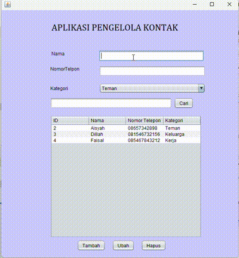

# Aplikasi Pengelola Kontak

Aplikasi Pengelola Kontak adalah sebuah aplikasi berbasis Java yang memanfaatkan *SQLite database* untuk menyimpan dan mengelola data kontak. Aplikasi ini mendukung fitur penambahan, pengeditan, penghapusan, pencarian, serta menampilkan daftar kontak yang telah tersimpan.

## Keunggulan Aplikasi

- **Pengelolaan Kontak yang Mudah**: Tambahkan, ubah, hapus, atau cari kontak dengan antarmuka yang sederhana.
- **Integrasi Database SQLite**: Data kontak tersimpan secara aman dalam database lokal.
- **Kategori Kontak**: Pisahkan kontak berdasarkan kategori seperti "Teman", "Keluarga", atau "Kerja".
- **Antarmuka Sederhana**: Dibangun menggunakan Java Swing, aplikasi ini memiliki antarmuka yang ramah pengguna.

## Pembuat Aplikasi
Salsa Alya Istiqamah - 2210010089 - Latihan 3

## Fitur 

1. **Tambah Kontak Baru**  
   Tambahkan kontak baru dengan mengisi nama, nomor telepon, dan memilih kategori.

2. **Edit Kontak**  
   Perbarui informasi kontak yang sudah tersimpan di database.

3. **Hapus Kontak**  
   Hapus kontak yang tidak diperlukan dengan memilihnya dari daftar.

4. **Cari Kontak**  
   Cari kontak berdasarkan nama atau nomor telepon menggunakan fitur pencarian.

5. **Tampilkan Daftar Kontak**  
   Menampilkan seluruh kontak dalam bentuk tabel yang mencakup ID, nama, nomor telepon, dan kategori.

6. **Penyimpanan Data Lokal**  
   Semua data kontak disimpan di database SQLite untuk kemudahan akses dan keamanan data.

## Cara Menjalankan

1. **Persiapan**
   - Pastikan *Java Development Kit (JDK)* sudah terinstal di komputer Anda.
   - Unduh atau clone proyek ini ke dalam komputer Anda.

2. **Konfigurasi IDE**
   - Buka proyek di IDE seperti NetBeans, IntelliJ IDEA, atau Eclipse.
   - Tambahkan driver JDBC SQLite ke proyek Anda.

3. **Jalankan Aplikasi**
   - Kompilasi dan jalankan file `Latihan3.java`.
   - Aplikasi akan otomatis membuat database `kontak.db` jika belum tersedia.

## Cara Menggunakan

1. Jalankan aplikasi dan antarmuka utama akan ditampilkan.
2. Masukkan informasi kontak pada bagian input:  
   - **Nama**: Masukkan nama kontak.  
   - **Nomor Telepon**: Masukkan nomor telepon kontak.  
   - **Kategori**: Pilih kategori kontak dari dropdown (Teman, Keluarga, Kerja).  
3. Klik tombol **Tambah** untuk menyimpan kontak baru.  
4. Pilih kontak dari tabel untuk mengedit atau menghapusnya menggunakan tombol **Ubah** atau **Hapus**.  
5. Gunakan tombol **Cari** untuk mencari kontak berdasarkan nama atau nomor telepon.

## Demo

