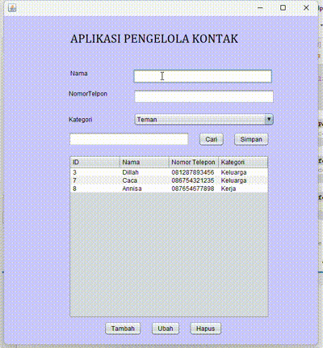

# Aplikasi Pengelola Kontak

Aplikasi Pengelola Kontak adalah aplikasi berbasis Java yang dirancang untuk membantu pengguna menyimpan, mengelola, dan mencari informasi kontak secara mudah. Aplikasi ini menggunakan Java Swing untuk antarmuka grafis dan SQLite sebagai database lokal untuk menyimpan data.

## Keunggulan Aplikasi

- **Pengelolaan Kontak yang Mudah**  
  Antarmuka yang sederhana dan intuitif mempermudah pengguna menambah, mengedit, mencari, dan menghapus kontak.

- **Validasi Input Otomatis**  
  Menjamin nomor telepon yang dimasukkan valid (hanya angka, panjang 10-13 digit), mengurangi risiko kesalahan data.

- **Ekspor Data ke CSV**  
  Memungkinkan pengguna menyimpan data kontak ke file CSV untuk keperluan backup atau transfer data.

- **Pencarian Kontak yang Cepat**  
  Fitur pencarian yang efisien mempermudah menemukan kontak berdasarkan nama atau nomor telepon.

- **Berjalan Tanpa Internet**  
  Karena data disimpan secara lokal, aplikasi ini dapat digunakan tanpa koneksi internet.

- **Kategori Kontak yang Dapat Dikustomisasi**  
  Kontak dapat dikelompokkan berdasarkan kategori seperti "Teman", "Keluarga", atau "Kerja".

---
## Pembuat Aplikasi

Salsa Alya Istiqamh - 2210010089 - Latihan 3

## Fitur

1. **Tambah Kontak**  
   Memasukkan data kontak baru seperti nama, nomor telepon, dan kategori.

2. **Ubah Kontak**  
   Memungkinkan pengeditan informasi kontak yang sudah ada.

3. **Hapus Kontak**  
   Menghapus kontak yang tidak diperlukan.

4. **Cari Kontak**  
   Mencari kontak berdasarkan nama atau nomor telepon dengan hasil pencarian yang cepat dan akurat.

5. **Ekspor ke CSV**  
   Menyimpan data kontak dalam format CSV untuk backup atau kebutuhan lain.

6. **Validasi Input**  
   - Hanya menerima nomor telepon dengan format angka.
   - Panjang nomor telepon dibatasi antara 10 hingga 13 digit.

---

## Cara Menjalankan

1. **Persiapan**
   - Pastikan JDK sudah terinstal di komputer Anda.
   - Unduh atau clone repositori ini ke komputer Anda.

2. **Menjalankan Proyek**
   - Buka proyek di IDE seperti IntelliJ IDEA atau NetBeans.
   - Jalankan file `Latihan3.java`.

3. **Database**
   - Database SQLite (`kontak.db`) akan dibuat secara otomatis jika belum tersedia.

---
## Demo

